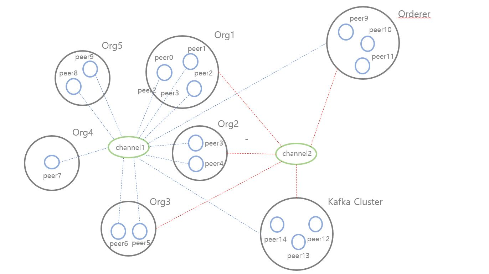

# LeLi

이 Github에 있는 자료들은 한국기술건설연구원(KICT), 무브먼츠와의 협약을 통해 부산시 스마트건설 시범사업에 참여한 레퍼런스를 기반으로 
Hyperledger-fabric 네트워크를 구성합니다.

이 네트워크를 구성하는 조직(Org)은 5개로 구분되며
각각 Order(LG u+), Contractor(대성산업), Subcontractor(대상, OAT), Data provider(무브먼츠), 
Governance(한국기술건설연구원, 부산시,과학기술정보통신부)로 정의됩니다.

블록을 생성하는 Orderer의 역할은 Governance 조직에 속하지 않는 또 다른 KICT,MSIT,부산시 Node들이 맡게 되며
이는 kafka와 zookeeper 기술을 이용하여 단일 장애점을 극복해낸 Multi Orderer로 구성합니다.

위 5개의 조직에 속해있는 모든 Peer들은 한 채널에 참여하여 트랜잭션을 생성하고 데이터를 공유합니다.
또한, Peer들은 기본값으로 설정되있는 levelDB가 아닌 couchDB를 연동하여 좀 더 복잡한 방식의 쿼리를 지원합니다.

이 네트워크의 운영 및 모니터링을 위한 도구로써 Prometheus를 연동하고, 이를 다시 Grafana와 연동하여
좀 더 시각적인 모니터링을 가능하게 합니다.

현재 한 개의 블록체인을 구성하여 5개의 조직 모두가 참여한 컨소시움을 이룬 형태이며,
추후 컨소시움을 더 세분화하여 각 조직이 필요로 하는 소통과 데이터 공유를 지원할 예정입니다.
